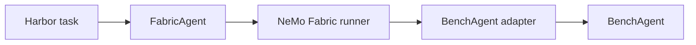

<!--
SPDX-FileCopyrightText: Copyright (c) 2026, NVIDIA CORPORATION & AFFILIATES. All rights reserved.
SPDX-License-Identifier: Apache-2.0
-->

# Use NVIDIA-labs Object Oriented Agents (NOOA) BenchAgent with NVIDIA NeMo Fabric

The [`nvidia.fabric.nooa.bench-agent` adapter](../nooa-bench.fabric-adapter.json)
runs `nooa_bench.BenchAgent` through the NeMo Fabric harness contract. It is
separate from the shared `InteractiveAgent` adapter because BenchAgent derives
from NOOA's base `Agent` and implements the benchmark-specific
`_run_evaluation(task_input)` contract.

Complete the [shared installation and Relay setup](../README.md) before using this
adapter.

## Task Mapping

One NeMo Fabric invocation maps to one BenchAgent task:

- The NeMo Fabric string input becomes `task_input.user_message`.
- The NeMo Fabric workspace becomes `task_input.working_dir`.
- `instructions.system` becomes `task_input.instructions`.
- The native `response`, `success`, and structured `result` fields become the
  normalized NeMo Fabric result.
- NOOA's task token accumulator becomes normalized usage.

The adapter accepts exactly one model. Before each task, it closes the shell
that `_run_evaluation()` replaces. During runtime shutdown, it closes the
active shell and model. Native errors are not copied into the public result
because they can contain model, tool, or environment details.

## Run with Harbor

Harbor selects the adapter through `FabricAgent` with
`fabric_adapter_id=nvidia.fabric.nooa.bench-agent`:

Harbor owns task materialization, the task workspace, verification, rewards,
retries, and job artifacts. The BenchAgent adapter owns model construction,
task execution, result normalization, Relay telemetry, and runtime cleanup.

The task environment must contain NeMo Fabric and
`nemo-fabric-adapters-nooa[harness]`. The adapter wheel supplies the BenchAgent
descriptor through installed-package discovery.

Follow the runnable
[BenchAgent Harbor walkthrough](../../../examples/harbor/nooa_bench/README.md)
to prepare the task image, run the baseline, verify the Harbor reward, and
validate Relay artifacts.

## Relay Telemetry

Each Relay-enabled invocation installs NOOA's public `install_nemo_relay()`
middleware and opens one `nooa-bench-agent-request` scope. The middleware
records nested BenchAgent methods, LLM calls, and `execute_python` tool calls.

`Runtime.invoke_stream()` can consume the resulting ATOF records while the
adapter runs its ordinary `invoke` operation. This adapter does not implement
native model-response streaming.
