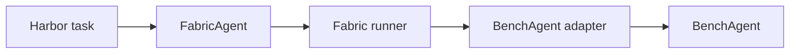

<!--
SPDX-FileCopyrightText: Copyright (c) 2026, NVIDIA CORPORATION & AFFILIATES. All rights reserved.
SPDX-License-Identifier: Apache-2.0
-->

# Run NVIDIA-labs Object Oriented Agents (NOOA) BenchAgent with Harbor

This walkthrough evaluates NOOA `BenchAgent` through an NVIDIA NeMo Fabric
complete Harbor path:



Harbor owns the task container, verification, reward, retries, and job layout.
The BenchAgent adapter owns model construction, one task execution, normalized
results, optional Relay telemetry, and cleanup.

## Prepare the Task Image

Complete the [shared Harbor setup](../README.md#shared-host-setup) and set a
valid NVIDIA API key:

```bash
export NVIDIA_API_KEY="..."
```

Build source-consistent Fabric wheels, including the NOOA adapter and a
manylinux runtime wheel, into the ignored Docker build context:

```bash
./examples/harbor/nooa_bench/prepare.sh
```

The task image installs `nemo-fabric-adapters-nooa[full]` from the built wheel, while
its package metadata installs the tested `nooa`, `nooa-cli`, `nooa-bench`, and
Relay versions from PyPI. `prepare.sh` builds the required NeMo Fabric wheels in
a fresh temporary directory and uses Maturin with Zig for manylinux 2.17
compatibility, so the Python 3.12 Debian task image does not depend on the glibc
version installed in the host.

## Run the Baseline

Run from the repository root:

```bash
uv run --extra harbor harbor run \
  --path examples/harbor/nooa_bench/task \
  --agent nemo_fabric.integrations.harbor:FabricAgent \
  --model nvidia/nemotron-3-nano-omni-30b-a3b-reasoning \
  --ak fabric_adapter_id=nvidia.fabric.nooa.bench-agent \
  --ak fabric_workspace=/app \
  --ak fabric_model_base_url=https://integrate.api.nvidia.com/v1 \
  --ak fabric_runtime_timeout_seconds=780 \
  --ae "NVIDIA_API_KEY=$NVIDIA_API_KEY" \
  --job-name nooa-bench-baseline \
  --jobs-dir examples/harbor/nooa_bench/runs \
  --n-concurrent 1 \
  --n-attempts 1 \
  --force-build
```

Validate the completed trial, normalized result, and reward:

```bash
uv run python examples/harbor/nooa_bench/verify_run.py \
  examples/harbor/nooa_bench/runs/nooa-bench-baseline
```

## Run with Relay Telemetry

Repeat the same run with Relay enabled:

```bash
uv run --extra harbor harbor run \
  --path examples/harbor/nooa_bench/task \
  --agent nemo_fabric.integrations.harbor:FabricAgent \
  --model nvidia/nemotron-3-nano-omni-30b-a3b-reasoning \
  --ak fabric_adapter_id=nvidia.fabric.nooa.bench-agent \
  --ak fabric_workspace=/app \
  --ak fabric_model_base_url=https://integrate.api.nvidia.com/v1 \
  --ak fabric_runtime_timeout_seconds=780 \
  --ak fabric_telemetry=relay \
  --ae "NVIDIA_API_KEY=$NVIDIA_API_KEY" \
  --job-name nooa-bench-relay \
  --jobs-dir examples/harbor/nooa_bench/runs \
  --n-concurrent 1 \
  --n-attempts 1 \
  --force-build
```

Validate the reward plus the ATOF, promoted ATIF, nested LLM/tool scopes, and
single root invocation:

```bash
uv run python examples/harbor/nooa_bench/verify_run.py \
  examples/harbor/nooa_bench/runs/nooa-bench-relay \
  --require-relay
```

## Run a SWE-Bench Task

The standard `swe-bench/django__django-13741` image uses Python 3.11, while
NOOA requires Python 3.12 or 3.13. Prepare a local copy that keeps the registry
task instruction and verifier unchanged but adds an isolated Python 3.12
environment for NeMo Fabric, NOOA, and Relay:

```bash
./examples/harbor/nooa_bench/prepare_swebench.sh
```

The helper also performs the wheel build from `prepare.sh`. It writes the
prepared task only to ignored paths.

Run the task with Relay enabled:

```bash
: "${NVIDIA_API_KEY:?Export NVIDIA_API_KEY before running BenchAgent}"

export SWEBENCH_TASK="$PWD/examples/harbor/nooa_bench/runs/prepared-django__django-13741"
export RUNS_DIR="$PWD/examples/harbor/nooa_bench/runs"
export JOB_NAME=nooa-bench-swebench-django-13741-relay

uv run --extra harbor harbor run \
  --path "$SWEBENCH_TASK" \
  --agent nemo_fabric.integrations.harbor:FabricAgent \
  --model nvidia/nemotron-3-nano-omni-30b-a3b-reasoning \
  --ak fabric_adapter_id=nvidia.fabric.nooa.bench-agent \
  --ak fabric_workspace=/testbed \
  --ak fabric_python=/opt/nemo-fabric-venv/bin/python \
  --ak fabric_model_base_url=https://integrate.api.nvidia.com/v1 \
  --ak fabric_runtime_timeout_seconds=2700 \
  --ak fabric_timeout_sec=2900 \
  --ak fabric_telemetry=relay \
  --ae "NVIDIA_API_KEY=$NVIDIA_API_KEY" \
  --job-name "$JOB_NAME" \
  --jobs-dir "$RUNS_DIR" \
  --n-concurrent 1 \
  --n-attempts 1 \
  --max-retries 1 \
  --force-build
```

The SWE-Bench verifier determines whether the patch solves the task. A reward
of `0.0` is a valid completed run, so allow that outcome when validating the
Fabric and Relay artifacts:

```bash
uv run python examples/harbor/nooa_bench/verify_run.py \
  "$RUNS_DIR/$JOB_NAME" \
  --require-relay \
  --allow-zero-reward
```

The command checks the normalized result, Relay configuration, balanced ATOF
scopes, one BenchAgent root invocation, nested LLM and `execute_python` calls,
ATIF schema and step counts, and byte-for-byte promotion to Harbor's canonical
`agent/trajectory.json`. Inspect the generated patch and telemetry summary:

```bash
find "$RUNS_DIR/$JOB_NAME" \
  -path '*/agent/fabric-artifacts/**/workspace.patch' \
  -exec sed -n '1,200p' {} \;
find "$RUNS_DIR/$JOB_NAME" \
  -path '*/agent/telemetry-validation.json' \
  -exec uv run python -m json.tool {} \;
```

The direct Relay files remain under `agent/fabric-artifacts/`. Harbor also
publishes the ATIF as `agent/trajectory.json` and the run summary as
`agent/telemetry-validation.json`.

Harbor masks the value in its persisted config, but `--ae` supplies it to the
container process. Treat host process inspection and retained debug output as
sensitive while a credentialed run is active.
